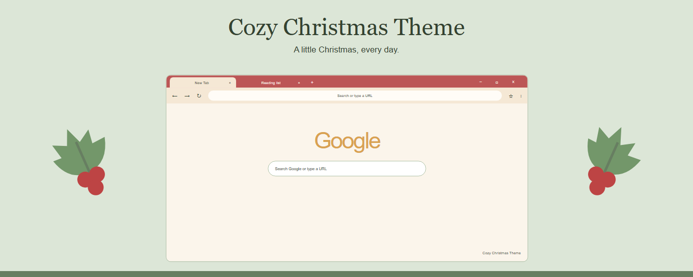
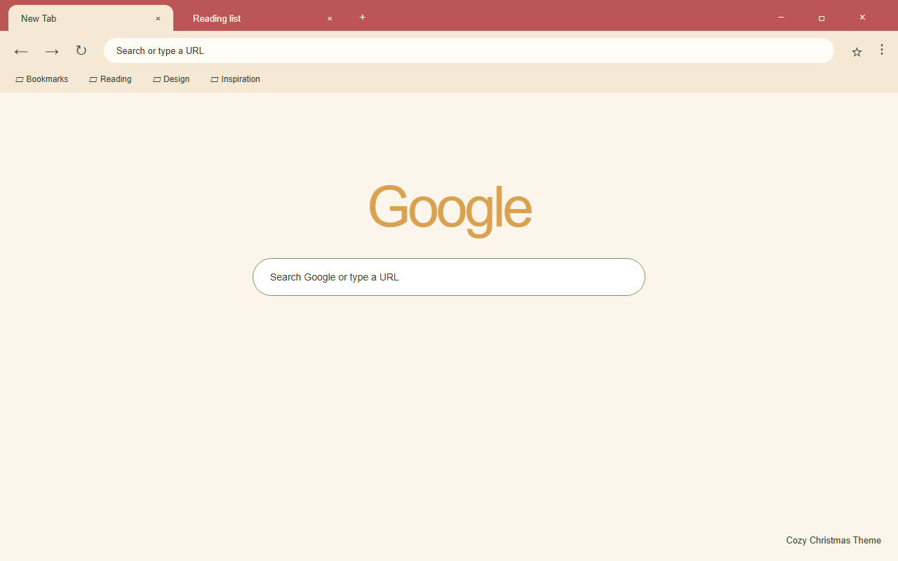
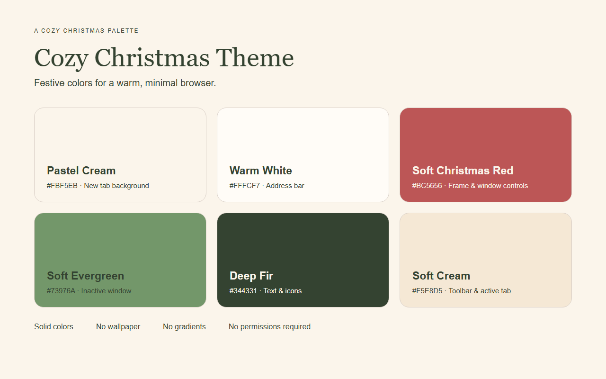
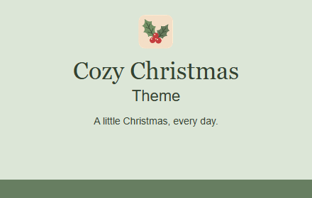

<p align="center">
  
</p>

<h1 align="center">Cozy Christmas Theme</h1>

<p align="center">
  A cozy, minimal Chrome theme in festive red, warm cream, and soft evergreen.
  <br>
  以圣诞暖红、奶油米与柔和松绿打造的温暖复古圣诞风 Chrome 主题。
</p>

<p align="center">
  
</p>

## Overview

Cozy Christmas Theme wraps your browser in a warm holiday palette that still feels calm enough for everyday use. A festive red top frame sits above a warm cream toolbar and bookmarks bar, while an ivory new tab page keeps the address bar and content area bright. Deep spruce ink keeps every label readable, and soft evergreen tints the inactive window frame as a quiet seasonal accent.

Cozy Christmas Theme 用一套温暖的节日配色包裹浏览器：顶部框架是圣诞暖红，工具栏与书签栏是奶油米，新标签页则用象牙白提亮。文字统一采用深杉绿，保证清晰可读；失焦窗口框架用柔和松绿点缀。纯色界面、无壁纸、无渐变，节日感到位但不喧闹。

## Palette

| Role | Hex | Used for |
|------|-----|----------|
| Festive Red 圣诞暖红 | `#BC5656` | top frame, tab strip, buttons |
| Warm Cream 奶油米 | `#F5E8D5` | toolbar, active tab, bookmarks bar |
| Ivory 象牙白 | `#FBF5EB` | new tab page background |
| Soft Evergreen 柔和松绿 | `#73976A` | inactive window frame, accent |
| Deep Pine 深松绿 | `#677E61` | brand accent for promo artwork |
| Light Cream 浅奶油 | `#FFFCF7` | address bar, tab text on red |
| Spruce Ink 深杉绿 | `#344331` | text and icons on light surfaces |

The first four colors come from the original palette. The two supplementary tones exist for legibility and address-bar depth, so small text never falls back to a pale green.

前四个颜色来自原始色卡，两个补充色用于文字辨识与地址栏层次，避免小字号用浅绿导致看不清。

## Design

- Solid colors only — no wallpaper, no textures, no gradients. 纯色界面，无壁纸、无纹理、无渐变。
- Festive red frame with a cream active tab, so the current page is always obvious. 暖红标签栏搭配奶油色当前标签页，当前页面一眼可辨。
- Toolbar, active tab, and bookmarks bar share one continuous cream surface. 工具栏、当前标签页与书签栏同色衔接。
- Ivory address bar and new tab page for a bright, low-glare reading area. 地址栏与新标签页用象牙白提亮。
- `ntp_logo_alternate` is enabled, so Chrome adapts the new tab page Google logo to the theme on its own; the exact tone is calculated by Chrome, not by the theme. 已启用 `ntp_logo_alternate`，新标签页 Google 标志由 Chrome 自行生成单色，具体色调以 Chrome 实测为准。
- No scripts, no permissions, no tracking. The theme only recolors the parts of Chrome that themes are allowed to touch. 无脚本、无权限、无追踪，只改 Chrome 允许主题染色的部分。

## What you get

- A festive red top frame that ties the whole window together.
- A warm cream toolbar and bookmarks bar for a quiet, comfortable surface.
- A brighter ivory address bar and new tab page for focus.
- Spruce ink text that stays legible at every size.
- A single 128 px holly-and-berry logo used by both the theme and the store listing.

## Preview

<p align="center">
  
</p>

<p align="center">
  
</p>

<p align="center">
  
</p>

Both screenshots are illustrative layouts rendered with headless Chromium from the real `manifest.json` colors. They are not native window captures, and the Google logo tone in the mockups is an approximation of what Chrome generates.

截图与宣传图均由无头 Chromium 读取 `manifest.json` 的真实配色渲染，属于界面示意，不是原生窗口实拍；示意图中的 Google 标志色调为近似值。

## Install

### Load unpacked (local)

1. Open `chrome://extensions` in Chrome.
2. Enable **Developer mode** (top-right).
3. Click **Load unpacked** and select this folder.
4. Open a new tab — the theme applies immediately.

### From Chrome Web Store

1. Open the Cozy Christmas Theme listing on the Chrome Web Store.
2. Click **Add to Chrome**.

## Files

| File | Description |
|------|-------------|
| `manifest.json` | Chrome theme manifest (MV3) with all theme colors |
| `logo/logo128.png` | The single 128 px logo, shared by the theme and store listing |
| `store-assets/screenshots/en/` | English store screenshots, 1280×800 |
| `store-assets/promo/` | `440x280.png` and `1400x560.png` promo tiles |
| `store-assets/references/` | HTML sources and unrendered inputs for the store artwork |
| `store-assets/store-description.txt` | Store listing description |
| `store-assets/ASSET-NOTES.md` | Notes on how the artwork was produced |
| `scripts/` | Asset generation and packaging scripts |
| `PACKAGING.md` | Packaging output notes |

## Packaging

```powershell
powershell -ExecutionPolicy Bypass -File scripts/package.ps1
```

This produces a single ZIP with `manifest.json` at the archive root, written to `D:\迅雷下载\vibe coding\cozy-christmas-theme-<version>.zip`. Promo tiles and screenshots are uploaded separately in the Chrome Web Store dashboard.

打包只生成一个完整 ZIP，`manifest.json` 位于 ZIP 根目录；promo 与截图需在商店后台对应素材栏单独上传。

## Rebuilding the store artwork

```powershell
pip install -r scripts/requirements.txt
playwright install chromium
python scripts/generate-store-assets.py
```

The script renders the reference HTML with headless Chromium and validates that `logo/logo128.png` is exactly 128×128. It does not generate extra logo sizes or duplicate copies.

Logo 为 GPT Image 生成后缩放的唯一 128 px 成品，脚本只做校验，不生成其它尺寸或副本。
